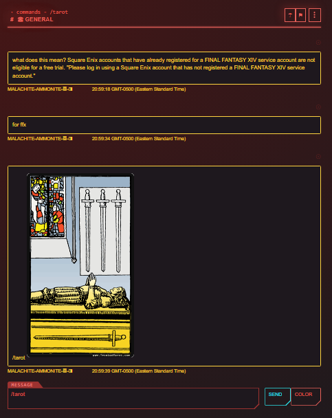

# talis-cc-chat

talis chatabout is a p2p groupchat that allows members to provide relatable information like online status, color, and spirit to the conversation. Members can pull tarots or browse popular and current utf-8's.

