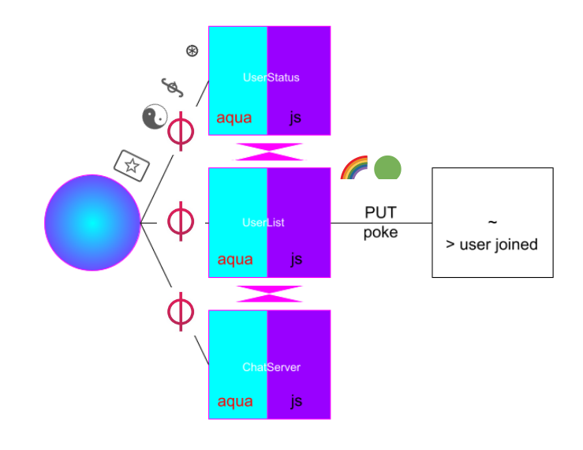

# ⊛ talis-cc-chat

talis / chatabout is a p2p groupchat that allows members to provide relatable information like online status, color, and spirit to the conversation, while still retaining a sense of privacy. Members can pull tarots or browse popular and current utf-8's.

# ◮ Problems areas addressed
🃟  Moderating community via tarots
☯   Ephemeral spirit provided per connection
∲   Timestamps → Future: Slot Adjustable
⊛   Copy-Paste → Triggering WSS Page Feed 
🌈  Color Adjustment
🟢  Online Status

# ▦ architecture

currently the application runs using aqua (compiled AIR script) and javascript to allow there to be a bridge between a fluence peerId instance and an urbit ship hosted on a platform, like third.earth, sending HTTPS requests via pokes which present a heads up feed of who's playing in chatabout.

# 🦠 stack
ɸ fluence ~ urbit 

# ↟ some futures
♲  Requires at least 1 mod to moderate conversation up to 14 folks, logs in via +code, can shutdown on prompt
🗣️ @p registry service storing addresses, to ships, tridentity naming with ENS, with scaled ~64 talis slot extension
🎴 Chat Widget from server side react-component rendering
🫐 Collective blueberry chat sensibility monitor
